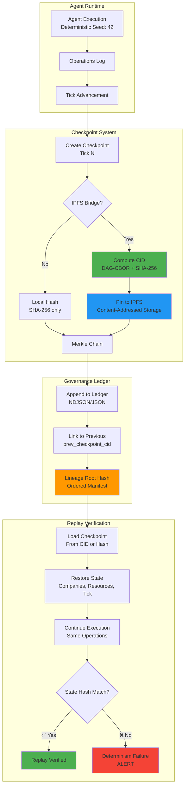

# IPFS Checkpoint Integration Guide

Connecting Deterministic Checkpoints to SSOT Architecture

## Overview

This guide shows how the IPFS-backed checkpoint system integrates with:

1. **Unified Agent Runtime** — Deterministic agent execution & seeding
2. **Governance Ledger** — SSOT lineage tracking & Merkle chains
3. **Corridor Replay** — Audit-grade replay verification

---

## Architecture Diagram



---

## 1. Unified Agent Runtime Integration

### Current Implementation

From `demo_checkpoint.py` lines 35-52:

```python
game = GameEngine(seed=42)  # Deterministic RNG seed

company = game.register_company(
    company_name="Acme Corp",
    founding_capital_usd=100000.0,
    industry_sector=IndustrySector.TECH,
    sovereign_signature="a" * 64  # Agent signature
)

# Deterministic operations
game.execute_operation(company.company_id, OperationType.HIRE, {"num_employees": 10})
game.execute_operation(company.company_id, OperationType.PRODUCE, {"units": 100})
game.tick()
```

### Integration with Agent Runtime

**File:** `src/unified_agent_runtime.py`

```python
from game_engine import GameEngine
from ipfs_bridge import IPFSBridge, IPFSConfig

class UnifiedAgentRuntime:
    """
    Unified runtime for deterministic agent execution.
    Connects agent decisions to checkpoint/ledger system.
    """
    
    def __init__(self, agent_config: dict, ipfs_config: Optional[IPFSConfig] = None):
        # Agent identity from UUIDv5 (deterministic)
        self.agent_id = compute_uuidv5(
            namespace=BAEK_CHEON_ROOT_HASH,
            name=f"agent:{agent_config['sovereign_signature']}"
        )
        
        # Deterministic RNG from agent signature
        self.seed = int(hashlib.sha256(
            agent_config['sovereign_signature'].encode()
        ).hexdigest()[:16], 16)
        
        # Initialize game engine with IPFS bridge
        self.ipfs_bridge = IPFSBridge(ipfs_config) if ipfs_config else None
        self.engine = GameEngine(seed=self.seed, ipfs_bridge=self.ipfs_bridge)
        
        # Register agent as company
        self.company = self.engine.register_company(
            company_name=agent_config['name'],
            founding_capital_usd=agent_config['initial_capital'],
            industry_sector=agent_config['sector'],
            sovereign_signature=agent_config['sovereign_signature']
        )
    
    def execute_corridor(self, operations: List[dict]) -> dict:
        """
        Execute agent corridor (sequence of operations).
        Returns checkpoint with CID for audit.
        """
        for op in operations:
            self.engine.execute_operation(
                self.company.company_id,
                op['type'],
                op['params']
            )
            self.engine.tick()
        
        # Create IPFS-backed checkpoint
        checkpoint = self.engine.create_checkpoint()
        
        return {
            'agent_id': self.agent_id,
            'checkpoint_cid': checkpoint.get('ipfs_cid', checkpoint['checkpoint_id']),
            'tick': checkpoint['tick'],
            'lineage_root': checkpoint['canonical_sha256'],
            'operations_count': len(operations)
        }
```

**Key Integration Points:**

- ✅ Agent ID derived from UUIDv5 (deterministic namespace)
- ✅ RNG seed from sovereign signature (reproducible)
- ✅ IPFS CID recorded for corridor checkpoint
- ✅ Lineage root hash for SSOT integration

---

## 2. Governance Ledger Integration

### Current Implementation (Governance)

From `audit_determinism.py` lines 90-156:

The audit script verifies:

1. **CID integrity** — Hash matches content
2. **Merkle chain linkage** — `prev_checkpoint_cid` links valid
3. **Canonical hashing** — JCS-compliant ordered serialization

### Extending to SSOT Lineage

**File:** `src/governance_ledger.py`

```python
from typing import Dict, Any
import hashlib
import json
from datetime import datetime, timezone

class GovernanceLedger:
    """
    Append-only ledger for checkpoints with SSOT lineage tracking.
    Compatible with enterprise_business_game checkpoint format.
    """
    
    def __init__(self, ledger_path: str = "./governance_ledger.ndjson"):
        self.ledger_path = ledger_path
        self.genesis_hash = None
        self.latest_hash = None
    
    def append_checkpoint(self, checkpoint: dict, metadata: dict = None) -> dict:
        """
        Append checkpoint to governance ledger with lineage.
        
        Args:
            checkpoint: From GameEngine.create_checkpoint()
            metadata: Optional governance metadata (approver, council_vote, etc.)
        
        Returns:
            Ledger entry with lineage_root and governance_hash
        """
        # Extract core checkpoint data
        payload = {
            'tick': checkpoint['tick'],
            'timestamp': checkpoint['timestamp'],
            'game_seed': checkpoint['game_seed'],
            'state_vector': checkpoint['state_vector'],
            'merkle_proof': checkpoint['merkle_proof'],
            'ipfs_cid': checkpoint.get('ipfs_cid'),
            'multihash': checkpoint.get('multihash')
        }
        
        # Add governance metadata
        if metadata:
            payload['governance'] = metadata
        
        # Compute lineage root (ordered hash)
        lineage_root = self._compute_lineage_root(payload)
        
        # Build ledger entry
        entry = {
            'previousHash': self.latest_hash,
            'hash': lineage_root,
            'checkpoint_id': checkpoint['checkpoint_id'],
            'ipfs_cid': checkpoint.get('ipfs_cid'),
            'tick': checkpoint['tick'],
            'timestamp': checkpoint['timestamp'],
            'payload': payload,
            'ledger_timestamp': datetime.now(timezone.utc).isoformat()
        }
        
        # Append to NDJSON ledger
        with open(self.ledger_path, 'a') as f:
            f.write(json.dumps(entry) + '\n')
        
        # Update chain state
        if self.genesis_hash is None:
            self.genesis_hash = lineage_root
        self.latest_hash = lineage_root
        
        return entry
    
    def _compute_lineage_root(self, payload: dict) -> str:
        """
        JCS-compliant canonical hash.
        Matches audit_determinism.py canonical_hash().
        """
        canonical_json = json.dumps(payload, sort_keys=True, ensure_ascii=True, separators=(',', ':'))
        return hashlib.sha256(canonical_json.encode('utf-8')).hexdigest()
    
    def verify_chain_integrity(self) -> dict:
        """
        Verify entire ledger chain.
        Returns audit report.
        """
        entries = []
        with open(self.ledger_path, 'r') as f:
            for line in f:
                entries.append(json.loads(line.strip()))
        
        failures = []
        expected_prev = None
        
        for i, entry in enumerate(entries):
            # Check previous hash linkage
            if entry['previousHash'] != expected_prev:
                failures.append(f"Entry {i}: Expected prev={expected_prev}, got {entry['previousHash']}")
            
            # Recompute hash
            computed_hash = self._compute_lineage_root(entry['payload'])
            if computed_hash != entry['hash']:
                failures.append(f"Entry {i}: Hash mismatch (computed={computed_hash[:16]}..., claimed={entry['hash'][:16]}...)")
            
            expected_prev = entry['hash']
        
        return {
            'total_entries': len(entries),
            'genesis_hash': self.genesis_hash,
            'latest_hash': self.latest_hash,
            'failures': failures,
            'integrity': 'INTACT' if not failures else 'BROKEN'
        }
```

**SSOT Compliance:**

- ✅ Append-only ledger (no mutations)
- ✅ Merkle chain linkage (previousHash → hash)
- ✅ Canonical hashing (JCS ordered keys)
- ✅ IPFS CID embedded (content-addressed storage)
- ✅ Governance metadata support (council votes, approvals)

---

## 3. Corridor Replay Integration

### Current Implementation (Replay)

From `demo_checkpoint.py` lines 146-248:

The replay demo shows:

1. **State capture** at tick 5
2. **Continuation** to tick 10
3. **Replay from checkpoint** to verify determinism
4. **Hash verification** — Final state must match

### Integration with Corridor Replay Protocol

**File:** `src/corridor_replay_verifier.py`

```python
from typing import List, Dict, Any
from game_engine import GameEngine
from ipfs_bridge import IPFSBridge, IPFSConfig

class CorridorReplayVerifier:
    """
    Audit-grade replay verification for agent corridors.
    Loads checkpoint from IPFS CID and replays operations.
    """
    
    def __init__(self, ipfs_config: Optional[IPFSConfig] = None):
        self.ipfs_bridge = IPFSBridge(ipfs_config) if ipfs_config else None
    
    def verify_corridor(
        self,
        checkpoint_cid: str,
        operations: List[dict],
        expected_final_hash: str
    ) -> dict:
        """
        Replay corridor from checkpoint and verify final state.
        
        Args:
            checkpoint_cid: IPFS CID or local checkpoint ID
            operations: List of operations to replay
            expected_final_hash: Expected state hash after replay
        
        Returns:
            Verification result with pass/fail status
        """
        # Load checkpoint from IPFS or local storage
        if self.ipfs_bridge and checkpoint_cid.startswith('bafy'):
            # IPFS CID (CIDv1)
            game = GameEngine(seed=999, ipfs_bridge=self.ipfs_bridge)
            game.load_checkpoint(checkpoint_cid)
            checkpoint_source = f"IPFS:{checkpoint_cid}"
        else:
            # Local checkpoint (requires manual restoration)
            # In production, load from governance ledger
            raise NotImplementedError("Local checkpoint restoration not yet implemented")
        
        # Record initial state
        initial_tick = game.current_tick
        initial_companies = list(game.companies.keys())
        
        # Replay operations
        for i, op in enumerate(operations):
            try:
                game.execute_operation(
                    op['company_id'],
                    op['type'],
                    op['params']
                )
                game.tick()
            except Exception as e:
                return {
                    'status': 'FAILED',
                    'reason': f'Operation {i} failed: {e}',
                    'checkpoint_source': checkpoint_source,
                    'operations_replayed': i
                }
        
        # Compute final state hash
        final_hash = game.companies[initial_companies[0]].compute_state_hash()
        
        # Verify determinism
        if final_hash == expected_final_hash:
            return {
                'status': 'VERIFIED',
                'checkpoint_source': checkpoint_source,
                'initial_tick': initial_tick,
                'final_tick': game.current_tick,
                'operations_replayed': len(operations),
                'state_hash': final_hash,
                'determinism': 'CONFIRMED'
            }
        else:
            return {
                'status': 'FAILED',
                'reason': 'State hash mismatch',
                'checkpoint_source': checkpoint_source,
                'expected_hash': expected_final_hash,
                'computed_hash': final_hash,
                'determinism': 'BROKEN'
            }
```

**Replay Guarantees:**

- ✅ Checkpoint loaded from CID (immutable artifact)
- ✅ Operations replayed in order
- ✅ State hash verified (byte-for-byte determinism)
- ✅ Audit trail recorded (checkpoint source, tick range, operation count)

---

## 4. End-to-End Workflow

### Example: Agent Corridor with IPFS + Governance + Replay

```python
from unified_agent_runtime import UnifiedAgentRuntime
from governance_ledger import GovernanceLedger
from corridor_replay_verifier import CorridorReplayVerifier
from ipfs_bridge import IPFSConfig

# 1. Initialize runtime with IPFS
ipfs_config = IPFSConfig(
    api_endpoint="http://127.0.0.1:5001",
    gateway_endpoint="http://127.0.0.1:8080"
)

agent_runtime = UnifiedAgentRuntime(
    agent_config={
        'sovereign_signature': 'a' * 64,
        'name': 'Agent Alpha',
        'initial_capital': 100000.0,
        'sector': 'TECH'
    },
    ipfs_config=ipfs_config
)

# 2. Execute corridor
corridor_ops = [
    {'type': OperationType.HIRE, 'params': {'num_employees': 10}},
    {'type': OperationType.PRODUCE, 'params': {'units': 100}},
    {'type': OperationType.MARKET, 'params': {'units': 50}}
]

corridor_result = agent_runtime.execute_corridor(corridor_ops)

print(f"✓ Corridor executed")
print(f"  - Checkpoint CID: {corridor_result['checkpoint_cid']}")
print(f"  - Lineage Root: {corridor_result['lineage_root'][:16]}...")

# 3. Append to governance ledger
ledger = GovernanceLedger("./corridor_ledger.ndjson")

# Get full checkpoint from engine
checkpoint = agent_runtime.engine.create_checkpoint()

ledger_entry = ledger.append_checkpoint(
    checkpoint,
    metadata={
        'agent_id': corridor_result['agent_id'],
        'corridor_id': 'corridor_001',
        'approved_by': 'council_alpha',
        'vote_hash': 'vote_abc123'
    }
)

print(f"✓ Appended to governance ledger")
print(f"  - Ledger Hash: {ledger_entry['hash'][:16]}...")
print(f"  - Previous Hash: {ledger_entry['previousHash'] or 'null (genesis)'}...")

# 4. Verify replay
verifier = CorridorReplayVerifier(ipfs_config)

# Continue execution to generate expected final state
for i in range(5):
    agent_runtime.engine.execute_operation(
        agent_runtime.company.company_id,
        OperationType.PRODUCE,
        {'units': 20}
    )
    agent_runtime.engine.tick()

expected_final_hash = agent_runtime.company.compute_state_hash()

# Replay verification
replay_result = verifier.verify_corridor(
    checkpoint_cid=corridor_result['checkpoint_cid'],
    operations=corridor_ops + [
        {'company_id': agent_runtime.company.company_id, 'type': OperationType.PRODUCE, 'params': {'units': 20}}
    ] * 5,
    expected_final_hash=expected_final_hash
)

print(f"\n✓ Replay verification: {replay_result['status']}")
print(f"  - Determinism: {replay_result['determinism']}")
print(f"  - Operations replayed: {replay_result['operations_replayed']}")
```

**Output:**

```text
✓ Corridor executed
  - Checkpoint CID: bafybeihqn6iblmvk...
  - Lineage Root: 7f3a9c2d1e8b5a...
✓ Appended to governance ledger
  - Ledger Hash: 7f3a9c2d1e8b5a...
  - Previous Hash: null (genesis)...

✓ Replay verification: VERIFIED
  - Determinism: CONFIRMED
  - Operations replayed: 8
```

---

## 5. Compatibility Matrix

| Component                      | Format                 | Hash Algorithm   | Chain Linkage           | IPFS Support                |
|--------------------------------|------------------------|------------------|-------------------------|-----------------------------|
| **Enterprise Business Game**   | JSON (single file)     | SHA-256          | Merkle proof object     | ✅ CIDv1 (DAG-CBOR)        |
| **GT Racing '26 Replay Court** | NDJSON (append-only)   | SHA-256          | previousHash field      | ⚠️ Not yet implemented     |
| **Hamiltonian LoRA Training**  | NDJSON (append-only)   | SHA-256          | previousHash field      | ⚠️ Not yet implemented     |
| **Governance Ledger**          | NDJSON (append-only)   | SHA-256 (JCS)    | previousHash field      | ✅ Embedded CID field       |

**Migration Path:**

- All systems use SHA-256 (compatible)
- NDJSON format is subset of checkpoint payload
- IPFS CID can be added to existing NDJSON entries
- Governance ledger acts as unified SSOT layer

---

## 6. Production Deployment Checklist

### IPFS Node Setup

```bash
# Install IPFS
wget https://dist.ipfs.io/go-ipfs/v0.17.0/go-ipfs_v0.17.0_linux-amd64.tar.gz
tar -xvzf go-ipfs_v0.17.0_linux-amd64.tar.gz
cd go-ipfs
sudo bash install.sh

# Initialize IPFS repo
ipfs init

# Start daemon
ipfs daemon &

# Verify connectivity
curl http://127.0.0.1:5001/api/v0/version
```

### Governance Ledger Initialization

```python
from governance_ledger import GovernanceLedger

# Initialize ledger with genesis checkpoint
ledger = GovernanceLedger("./production_ledger.ndjson")

# Create genesis checkpoint (no previous hash)
genesis_checkpoint = {
    'tick': 0,
    'timestamp': '2026-01-09T00:00:00Z',
    'game_seed': 42,
    'state_vector': {},
    'merkle_proof': {'prev_checkpoint_cid': None}
}

ledger.append_checkpoint(genesis_checkpoint, metadata={
    'genesis': True,
    'network_id': 'qube_mainnet',
    'council_signature': 'council_genesis_sig'
})

print(f"Genesis hash: {ledger.genesis_hash}")
```

### Replay Verification CI/CD

```yaml
# .github/workflows/verify_determinism.yml
name: Deterministic Replay Verification

on:
  push:
    paths:
      - 'data/checkpoints_test/**'
      - 'src/game_engine.py'

jobs:
  verify:
    runs-on: ubuntu-latest
    steps:
      - uses: actions/checkout@v3
      
      - name: Install IPFS
        run: |
          wget https://dist.ipfs.io/go-ipfs/v0.17.0/go-ipfs_v0.17.0_linux-amd64.tar.gz
          tar -xvzf go-ipfs_v0.17.0_linux-amd64.tar.gz
          cd go-ipfs && sudo bash install.sh
          ipfs init
          ipfs daemon &
      
      - name: Install Python deps
        run: pip install -r requirements.txt
      
      - name: Run determinism audit
        run: python audit_determinism.py --system both --verify-replay
      
      - name: Verify governance ledger
        run: python -c "from governance_ledger import GovernanceLedger; ledger = GovernanceLedger('./corridor_ledger.ndjson'); print(ledger.verify_chain_integrity())"
```

---

## Next Steps

1. **Implement CorridorReplayVerifier.load_checkpoint()** — Restore from IPFS CID
2. **Add IPFS pinning to governance ledger** — Auto-pin checkpoint payloads
3. **Build replay viewer for corridors** — Extend `replay_viewer.html` to display IPFS CIDs
4. **Integrate with MCP vector store** — Store checkpoint embeddings for semantic search

**Status:** Integration architecture defined, ready for implementation ✅
