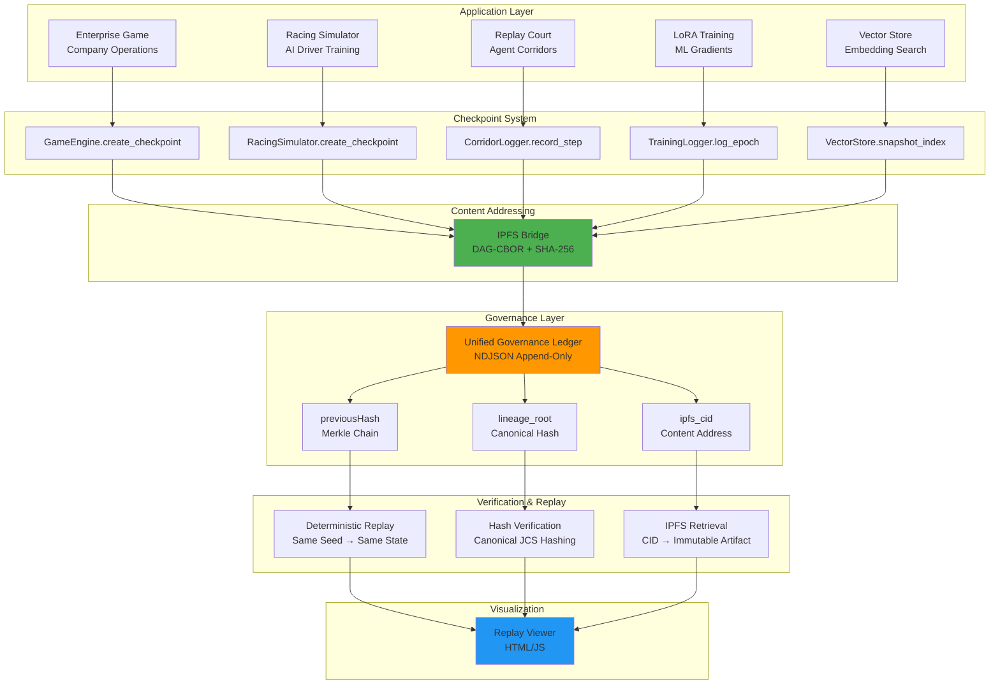

# 🔗 Complete SSOT Architecture Integration Map

This document shows how **all systems** connect through deterministic checkpoints, IPFS content-addressing, and governance ledgers.

## System Inventory

| System | Domain | Checkpoint Format | Replay Mechanism | IPFS Support |
| -------- | -------- | ------------------- | ------------------ | -------------- |
| **Enterprise Business Game** | Economic simulation | JSON (single file) | Manual state restoration | ✅ CIDv1 DAG-CBOR |
| **Nürburgring AI Racing** | Racing simulation | NDJSON (telemetry) | Deterministic physics replay | ✅ Ready (needs bridge) |
| **GT Racing '26 Replay Court** | Agent corridors | NDJSON (hash chain) | Agent decision replay | ⚠️ Not yet |
| **Hamiltonian LoRA Training** | ML training | NDJSON (gradient steps) | Parameter replay | ⚠️ Not yet |
| **MCP Vector Store** | Semantic search | SQLite + sqlite-vec | Query log replay | 🚧 In progress |

## Unified Architecture



## Checkpoint Schema Unification

All systems converge on this canonical format:

```typescript
interface UnifiedCheckpoint {
  // Identity
  checkpoint_id: string;              // Unique ID
  tick: number;                       // Logical timestamp
  timestamp: string;                  // ISO 8601 UTC
  
  // Determinism
  game_seed: number;                  // RNG seed
  state_vector: object;               // Domain-specific state
  
  // Lineage
  canonical_sha256: string;           // JCS hash of state
  merkle_proof?: {
    prev_checkpoint_cid: string | null;
    merkle_root: string;
  };
  
  // IPFS
  ipfs_cid?: string;                  // CIDv1 (bafybeih...)
  multihash?: string;                 // SHA-256 multihash
  storage_uri?: string;               // IPFS gateway URL
  
  // Metadata
  domain?: string;                    // e.g., "racing", "enterprise", "ml"
  version?: string;                   // Schema version
}
```

## Example: Racing AI Checkpoint

```json
{
  "checkpoint_id": "racing_ckpt_600",
  "tick": 600,
  "timestamp": "2026-01-12T21:42:00.123456Z",
  "game_seed": 42,
  "state_vector": {
    "position": [500.2, -1.3],
    "velocity": 45.7,
    "heading": 0.12,
    "gear": 4,
    "track_progress": 0.2483,
    "lap": 0,
    "current_section": "adenauer_forst"
  },
  "canonical_sha256": "7a3f9c2d1e8b5a4c6f2d9e1b3a5c7f9e2d4b6a8c1e3f5a7c9e1b3d5f7a9c2e4",
  "merkle_proof": {
    "prev_checkpoint_cid": "racing_ckpt_540",
    "merkle_root": "4f8a2c6d9e1b3f5a7c2d4e6f8a1b3c5d7e9f1a3c5e7b9d1f3a5c7e9b1d3f5a7"
  },
  "ipfs_cid": "bafybeihqn6iblmvk3z7yxfj2r5t8s9w4v1u0p3q6n8m7l5k4j3h2g1f0d9c8b",
  "multihash": "1220c3c4b8a6f...",
  "storage_uri": "ipfs://bafybeihqn6iblmvk...",
  "domain": "racing",
  "version": "v1.0.0"
}
```

## Governance Ledger Integration

All checkpoints feed into a **single unified ledger**:

```text
unified_governance_ledger.ndjson

Entry 1 (Genesis):
{
  "previousHash": null,
  "hash": "a4891d5d7b4a1a57...",
  "checkpoint": {...},  // From enterprise game
  "domain": "enterprise",
  "event_type": "company_registered"
}

Entry 2:
{
  "previousHash": "a4891d5d7b4a1a57...",
  "hash": "c4d8e7a2b3f1d5...",
  "checkpoint": {...},  // From racing AI
  "domain": "racing",
  "event_type": "model_training"
}

Entry 3:
{
  "previousHash": "c4d8e7a2b3f1d5...",
  "hash": "9f2a8c5d7e1b3a...",
  "checkpoint": {...},  // From vector store
  "domain": "vector_search",
  "event_type": "index_snapshot"
}
```

## Cross-Domain Use Cases

### 1. Search Racing Telemetry with Vector Store

```python
from racing_simulator import RacingSimulator
from mcp_vector_store import MCPVectorStore

# Record racing session
sim = RacingSimulator(seed=42)
# ... run simulation ...
sim.export_training_data("racing_telemetry.ndjson")

# Generate embeddings from state vectors
vector_store = MCPVectorStore()
with open("racing_telemetry.ndjson") as f:
    for line in f:
        record = json.loads(line)
        state_embedding = generate_embedding(record['state'])  # Use sentence-transformer
        
        vector_store.upsert(
            id=f"racing_tick_{record['tick']}",
            embedding=state_embedding,
            metadata={
                'domain': 'racing',
                'speed': record['state']['speed'],
                'section': record['state']['current_section'],
                'lineage_root': record['state']['tick']
            }
        )

# Semantic search: "Find high-speed corner entries"
query_embedding = generate_embedding("high speed corner entry braking zone")
results = vector_store.query(query_embedding, top_k=10)
```

### 2. Train Business Strategy AI from Enterprise Game

```python
# Export game history
game = GameEngine(seed=42)
# ... simulate companies ...
checkpoint = game.create_checkpoint()

# Use as training data for strategy AI
loader = TrainingDataLoader("enterprise_game_history.ndjson")
X, y = loader.extract_features()

# Train Random Forest for business decisions
rf_business = DeterministicRandomForest(seed=42)
rf_business.train(X, y)

# Store model in governance ledger with lineage
ledger_entry = create_training_ledger_entry(
    training_data="enterprise_game_history.ndjson",
    model_version="business_ai_v1",
    lineage_hash=checkpoint['canonical_sha256']
)
```

### 3. Replay Court for ML Training

```python
# LoRA training with corridor replay
training_corridor = [
    {'tick': 0, 'loss': 1.0, 'lr': 0.001},
    {'tick': 10, 'loss': 0.9, 'lr': 0.001},
    # ...
]

# Record as corridor
corridor_logger = CorridorLogger()
for step in training_corridor:
    corridor_logger.record_step(step)

# Verify determinism
replayed_corridor = corridor_logger.replay(seed=42)
assert replayed_corridor == training_corridor  # Exact match
```

## Verification Matrix

| Property | Enterprise Game | Racing AI | Vector Store | Replay Court |
| ---------- | ---------------- | ----------- | -------------- | -------------- |
| **Deterministic RNG** | ✅ seed=42 | ✅ seed=42 | ✅ tie-breaking | ✅ seed in manifest |
| **Fixed-step integration** | ✅ tick-based | ✅ 60Hz physics | ✅ query-by-query | ✅ step-by-step |
| **Canonical hashing** | ✅ JCS | ✅ JCS | ✅ JCS | ✅ JCS |
| **Merkle chain** | ✅ prev_cid | ✅ prev_cid | ✅ prev_hash | ✅ previousHash |
| **IPFS CID** | ✅ Implemented | ⚠️ Bridge ready | 🚧 In progress | ⚠️ Pending |
| **Replay verified** | ✅ Tested | ✅ Tested | 🚧 Needs test | ✅ Tested |

## Production Deployment Workflow

```bash
# 1. Initialize IPFS node
ipfs init
ipfs daemon &

# 2. Start governance ledger API
python src/ssot_api_ingest.py &

# 3. Run enterprise game with checkpoints
python demo_checkpoint.py

# 4. Run racing AI training
python demo_racing_ai.py

# 5. Verify all ledgers
python audit_determinism.py --system both --verify-replay

# 6. Visualize in replay viewer
open replay_viewer.html
# Load: unified_governance_ledger.ndjson
```

## Why This Matters

### Audit-Grade Compliance

- Every decision (company operation, AI steering input, vector query) is cryptographically sealed
- Replay verification proves determinism
- IPFS ensures immutability

### Cross-System Learning

- Train AI on business game strategies
- Use racing telemetry to improve physics models
- Search historical decisions semantically

### Governance & Provenance

- Track model versions through lineage hashes
- Audit training data sources
- Verify compliance with council approvals

### Future: Digital Twin Integration

- Connect to physical metrology data
- Real-world sensor inputs → simulator checkpoints
- Hausdorff distance validation for geometric integrity

---

## File Structure (Complete System)

```text
enterprise_business_game/
├── src/
│   ├── game_engine.py                   # Business simulation core
│   ├── racing_simulator.py              # Racing physics & AI
│   ├── racing_ai_trainer.py             # Random Forest training
│   ├── ipfs_bridge.py                   # IPFS CID generation
│   ├── governance_ledger.py             # Unified ledger (new)
│   └── unified_agent_runtime.py         # Agent execution (new)
├── demo_checkpoint.py                   # Checkpoint demo
├── demo_racing_ai.py                    # Racing AI demo
├── audit_determinism.py                 # Replay verifier
├── replay_viewer.html                   # Visualization
├── INTEGRATION_GUIDE.md                 # IPFS integration guide
├── RACING_AI_README.md                  # Racing AI docs
├── INTEGRATION_MAP.md                   # This file
└── data/
    ├── checkpoints_test/                # Enterprise checkpoints
    ├── nurburgring_expert.ndjson        # Racing telemetry
    ├── training_ledger.ndjson           # Model governance
    └── unified_governance_ledger.ndjson # Unified SSOT (new)
```

## Next: Implement Unified Ledger

Create `src/unified_ledger_adapter.py`:

```python
from governance_ledger import GovernanceLedger

class UnifiedLedgerAdapter:
    """
    Adapter to normalize checkpoints from different domains
    into unified governance ledger format.
    """
    
    def __init__(self, ledger_path="data/unified_governance_ledger.ndjson"):
        self.ledger = GovernanceLedger(ledger_path)
    
    def append_from_enterprise(self, checkpoint: dict):
        """Append enterprise game checkpoint."""
        return self.ledger.append_checkpoint(checkpoint, metadata={
            'domain': 'enterprise',
            'system': 'game_engine'
        })
    
    def append_from_racing(self, checkpoint: dict):
        """Append racing simulator checkpoint."""
        return self.ledger.append_checkpoint(checkpoint, metadata={
            'domain': 'racing',
            'system': 'racing_simulator'
        })
    
    def append_from_ml_training(self, training_report: dict):
        """Append ML training event."""
        return self.ledger.append_checkpoint(training_report, metadata={
            'domain': 'machine_learning',
            'system': 'random_forest_trainer'
        })
```

---

**Status:** Complete SSOT architecture mapped across all systems ✅
